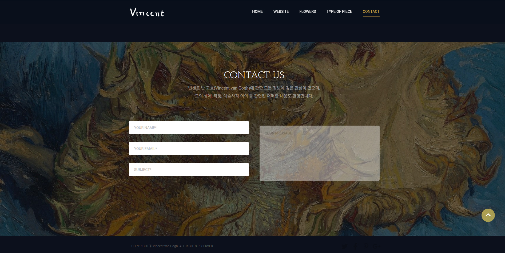

## 🎨 Artcenter Nabi 미술관 리뉴얼 웹사이트

아트센터 나비 미술관의 분위기와 정체성을 살려 리뉴얼한 반응형 웹사이트입니다. <br>
jQuery 기반의 DOM 제어로 사용자 상호작용을 구현하였고,  <br>
Swiper.js를 이용한 슬라이더와 다양한 해상도 대응을 고려한 구조로 제작하였습니다. <br>
갤러리와 콘텐츠 중심의 디자인을 반영하였습니다.

<br/>

### 🎯 주요 기능

- 해상도에 따라 메뉴 구조 및 스타일 자동 변경
- 모바일 환경에서의 햄버거 메뉴 및 dim 처리
- Swiper.js 기반 메인 슬라이더
- 슬라이더 자동 재생, 컨트롤러 클릭 이동 기능
- 720px 이하에서 상품 슬라이드형 배치 적용 (Swiper)
- 메뉴 hover 시 서브메뉴 활성화

<br/>

### 🛠️ 사용 기술

| 기술 | 설명 |
|------|------|
|  | 웹 표준을 준수한 마크업 구조 |
|  | 반응형 미디어쿼리 및 전반적 스타일링 |
|  | 메뉴 동작, 슬라이더 전환, 반응형 이벤트 구현 |
|  | 슬라이더 기능 구현 및 반응형 구성 |

<br/>

### 📸 데모 이미지

| 메인 슬라이더 | 모바일 메뉴(1depth) | 모바일 메뉴(2depth) |
|-------------|----------------|-------------|
|  |  |  |


<br/>

### ⚙️ 기능 상세 설명

### ✅  1. 반응형 구분 및 초기 해상도 체크

- 브라우저 초기 로딩 시, 화면 너비 기준으로 모바일 여부를 판단합니다.
- isMobile은 이후 여러 조건의 기준이 됩니다.

 ``` JavaScript
let isMobile = window.innerWidth <= 580;

$(window).resize(function () {
    if (window.innerWidth > 580) {
        // 데스크탑 화면일 때
        if (isMobile !== false) {
            isMobile = false;
        }
        // 모바일 메뉴 닫기
        $(".dim").removeClass("active");
        $("header nav").removeClass("active");
        $("header .menu").removeClass("active");
        document.body.style.overflow = "auto";
    } else {
        // 모바일 화면일 때
        if (isMobile !== true) {
            isMobile = true;
        }
    }
});
$(window).trigger("resize");
```

---

### ✅ 2. 메인 슬라이더 컨트롤 기능 (#slider)


📌 슬라이더 초기값
```javascript
let idx = 0;            // 현재 보여줄 슬라이드 인덱스
let targetx = 0;        // 이동할 위치값
let sliderw = 2000;     // 슬라이드 한 장의 너비 (px 기준)
```

📌 슬라이드 전환 함수
```javascript
    function galleryfn() {
        $("#slider .controller li").removeClass("on");
        $("#slider .controller li").eq(idx).addClass("on");

        targetx = -1 * sliderw * idx;

        $("#slider .image ul li").removeClass("active");
        $("#slider .image ul li").eq(idx).addClass("active");
    }

    $("#slider .controller ul li").eq(idx).addClass("on");
    $("#slider .image ul li").eq(idx).addClass("active");

    $("#slider .controller li").click(function (e) {
        e.preventDefault();
        idx = $(this).index();
        galleryfn();
    });
}
```

📌 컨트롤러 클릭 이벤트
```javascript
$("#slider .controller li").click(function (e) {
    e.preventDefault();
    idx = $(this).index(); // 클릭한 인덱스
    galleryfn();
});
```

📌 초기 슬라이드 세팅
```javascript
$("#slider .controller ul li").eq(idx).addClass("on");
$("#slider .image ul li").eq(idx).addClass("active");
```

📌 자동 슬라이드 (3초 간격)
```javascript
let slideInterval = setInterval(function () {
    idx = (idx + 1) % 4; // 슬라이드 총 4개 기준
    galleryfn();
}, 3000);
```

---

### ✅  3. Swiper 슬라이드 (Part1 영역)


📌 슬라이더 인스턴스 정의
```javascript
let swiper = null;
```

📌 화면 너비에 따른 슬라이드 생성/제거 함수
```javascript
function updateSwiper() {
    if (window.innerWidth < 720) {
        // 모바일: swiper 슬라이더 생성
        if (!swiper) {
            swiper = new Swiper(".mySwiper", {
                slidesPerView: 2,    // 한 번에 보일 슬라이드 수
                spaceBetween: 0,     // 슬라이드 간 여백
                loop: true,          // 무한 반복
                pagination: {
                    el: ".swiper-pagination",
                    clickable: true,
                },
                autoplay: {
                    delay: 3000,
                    disableOnInteraction: false,
                },
            });
        }
    } else {
        // 데스크탑: swiper 제거
        if (swiper) {
            swiper.destroy();
            swiper = null;
        }
    }
}
```

📌 적용 시점
```javascript
$(document).ready(updateSwiper);
$(window).resize(updateSwiper);
```

---

### ✅  4. 모바일 헤더 메뉴 토글

- 메뉴 버튼 클릭 시 nav, menu, dim에 .active 클래스 토글됩니다.
- 메뉴 열릴 때는 body 스크롤 잠금, 닫히면 스크롤 허용합니다.


```javascript
$("header .menu").click(function (e) {
    e.preventDefault();
    if (isMobile) {
        let isActive = $("header nav").hasClass("active");
        $(".dim, header nav, header .menu").toggleClass("active", !isActive);
        document.body.style.overflow = isActive ? "auto" : "hidden";
    }
});
```

---

### ✅  5. 모바일 메뉴 > 서브 메뉴 토글

- 상위 메뉴 클릭 시 .active 토글됩니다.
- 다른 메뉴는 자동으로 닫힙니다.


```javascript
$("header nav > ul > li").click(function (e) {
    e.preventDefault();
    $(this).toggleClass("active").siblings().removeClass("active");
});
```

---

### ✅  6. 데스크탑 전용 hover 효과

- 마우스 호버 시 .active 클래스 부여합니다.
- 모바일에서는 비활성화됩니다.


```javascript
$("header nav > ul > li, header nav > ul > li .sub li, #part1 .swiper-wrapper .swiper-slide a, #part3 .lab a").hover(
    function () {
        if (!isMobile) $(this).addClass("active");
    },
    function () {
        if (!isMobile) $(this).removeClass("active");
    }
);
```
