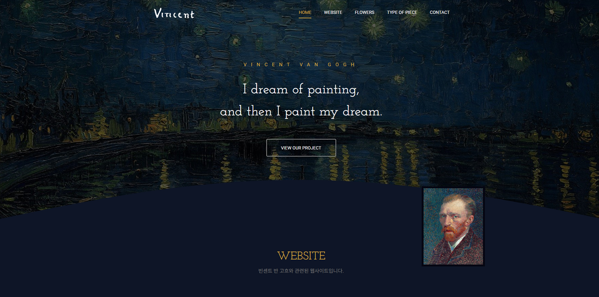
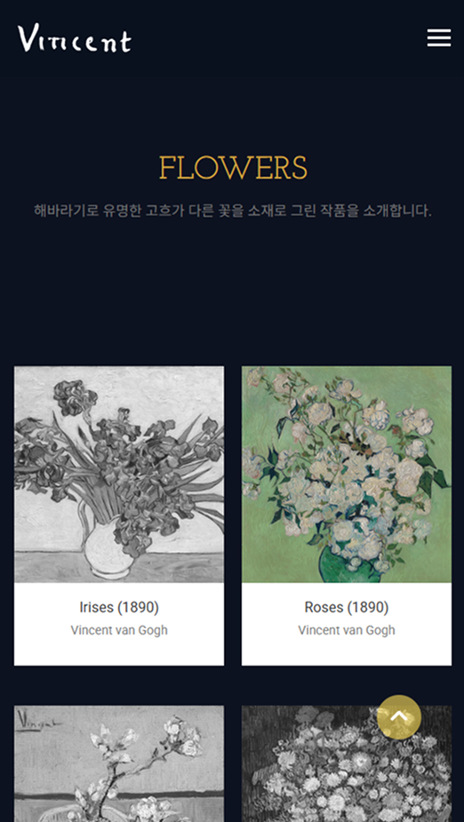
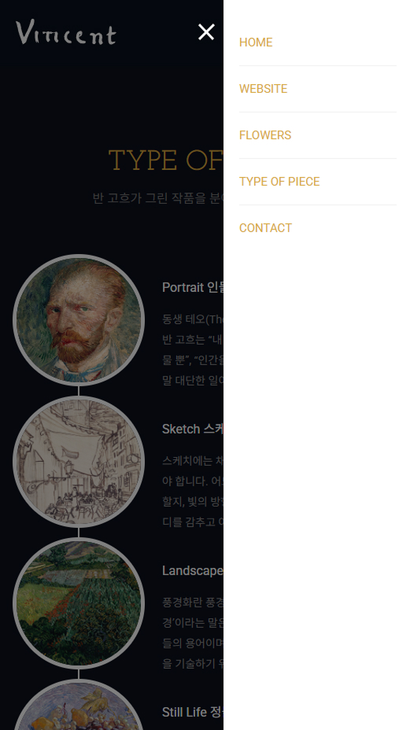

## 🌻🌟 Vincent Van Gogh 정보를 담은 반응형 웹사이트

Vincent Van Gogh의 작품을 소개하는 웹사이트로, 미술관 분위기에 맞는 디자인과 사용자 경험을 제공합니다. <br>
웹사이트는 반응형 디자인을 적용하여 다양한 해상도와 기기 환경에 최적화되어 있으며, <br>
사용자 상호작용을 JavaScript로 구현하였습니다. <br>
GSAP 애니메이션을 사용하여 슬라이더, 메뉴, 콘텐츠 등의 동적인 요소들을 부드럽게 처리합니다.

<br/>

### 🎯 주요 기능

- 해상도에 따른 자동 메뉴 구조 변경
- 스크롤에 따른 메뉴 자동 활성화
- 스크롤시 GSAP 사용으로 등장 애니메이션
- 탭 클릭시 부드러운 스크롤 이동 애니메이션
- 상단으로 이동 버튼

<br/>

### 🛠️ 사용 기술

| 기술 | 설명 |
|------|------|
|  | HTML5 마크업 구조 |
|  | CSS3 반응형 스타일 처리 |
|  | JavaScript DOM 제어, GSAP 연동 |
|  | GSAP 부드러운 애니메이션 |

<br/>

### 📸 데모 이미지

| 메인 슬라이더 | 모바일 반응형 UI | 모바일 메뉴 |
|-------------|----------------|-------------|
|  |  |  |


<br/>

### ⚙️ 기능 상세 설명

### ✅  1. 반응형 디자인 처리 (Mobile/Desktop 구분):

- 화면 크기에 따라 mobile과 desktop으로 구분하고, 각 기기 환경에 맞는 스타일을 적용합니다.

 ``` JavaScript
let isMobile;

function resizeTest() {
    if(window.innerWidth > 720){
        if(isMobile != "desktop") isMobile = "desktop";
    } else {
        if(isMobile != "mobile") isMobile = "mobile";
    }
};

resizeTest(); // 처음에 값을 가집니다.

window.addEventListener("resize", function(){
    resizeTest();
    if(window.innerWidth > 720){
        tab.classList.remove("active");
        mobile.classList.remove("active");
        dim.classList.remove("active");
    }
});
```

---

### ✅ 2. 섹션 메뉴 제어

-  메뉴 항목을 클릭하면 해당 섹션으로 부드럽게 스크롤 이동하며, 메뉴의 활성화/비활성화를 제어합니다.


```javascript
function controlMenu(n) {
    gnbList.forEach(function(item, i) {
        if(i == n) {
            gnbList[i].classList.add("active");
        } else {
            gnbList[i].classList.remove("active");
        }
    });

    if(n != 0) { // header 구간이 아닐 때
        menuArea.classList.add("fixed");
        btnTop.classList.add("active");
    } else {
        menuArea.classList.remove("fixed");
        btnTop.classList.remove("active");
    }
}

gnbList.forEach(function(item, i) {
    gnbList[i].addEventListener("click", function(e) {
        e.preventDefault();
        topPos = pageList[i].offsetTop;
        gsap.to(window, { scrollTo: topPos, duration: 0.4 });
    });

    mobileGnbList[i].addEventListener("click", function(e) {
        e.preventDefault();
        topPos = pageList[i].offsetTop;
        gsap.to(window, { 
            scrollTo: topPos, 
            duration: 0.4, 
            onComplete: function() {
                tab.classList.remove("active");
                mobile.classList.remove("active");
                dim.classList.remove("active");
            }
        });
    });
});
```

---

### ✅  3. 스크롤 트리거 (ScrollTrigger 사용)

- 페이지 섹션에 스크롤이 도달하면 애니메이션을 실행하도록 설정합니다.


```javascript
pageList.forEach(function(item, i) {
    gsap.timeline({
        scrollTrigger: {
            trigger: item,
            start: "top center",
            end: "bottom center",
            onEnter: function() {
                controlMenu(i);
            },
            onEnterBack: function() {
                controlMenu(i);
            }
        }
    });
});
```

---

### ✅  4. 상단으로 이동하는 버튼

- 스크롤이 내려가면 버튼이 나타나고, 클릭 시 페이지 상단으로 부드럽게 스크롤 이동합니다.


```javascript
btnTop.addEventListener("click", function(e) {
    e.preventDefault();
    gsap.to(window, { scrollTo: 0, duration: 0.4 });
});
```

---

### ✅  5. GSAP 애니메이션 (각 섹션별로)

-  각 섹션에 대해 GSAP 애니메이션을 적용하여, 페이지가 스크롤될 때마다 섹션 요소들이 애니메이션 효과를 적용받도록 합니다.


📌메인 애니메이션

```javascript
const startTl = gsap.timeline();

startTl.from(".text_zone p", {
    y: 30,
    opacity: 0,
    duration: 0.6
});
startTl.from(".text_zone h2", {
    y: 30,
    opacity: 0,
    duration: 0.6
});
startTl.from(".text_zone .more", {
    y: 30,
    opacity: 0,
    duration: 0.6
});
```

📌웹사이트 섹션 애니메이션

```javascript
const businessTl = gsap.timeline({
    scrollTrigger: {
        trigger: "#business",
        start: "top center",
        end: "bottom center"
    }
});

let businessList = document.querySelectorAll("#business li");

businessList.forEach(function(item, i) {
    if (i % 2 == 0) { // 짝수
        businessTl.from(item, { y: 100, opacity: 0, duration: 0.3 });
    } else { // 홀수
        businessTl.from(item, { y: -100, opacity: 0, duration: 0.3 });
    }
});
```

📌플라워 섹션 애니메이션

```javascript
const portfolioTl = gsap.timeline({
    scrollTrigger: {
        trigger: "#portfolio",
        start: "top center",
        end: "bottom center",
    }
});

let portfolioList = document.querySelectorAll("#portfolio li");

portfolioList.forEach(function(item, i) {
    portfolioTl.from(item, { y: 100, opacity: 0, duration: 0.2 });
});
```

📌분야별 소개 섹션 애니메이션

```javascript
const serviceTl = gsap.timeline({
    scrollTrigger: {
        trigger: "#service",
        start: "top center",
        end: "bottom center",
    }
});

let serviceList = document.querySelectorAll("#service li");

serviceList.forEach(function(item, i) {
    if (i % 2 == 0) { // 짝수
        serviceTl.from(item, { x: 100, opacity: 0, duration: 1.2, ease: "power2.out" });
    } else { // 홀수
        serviceTl.from(item, { x: -100, opacity: 0, duration: 1.2, ease: "power2.out" });
    }
});
```

📌연락처 섹션 애니메이션

```javascript
const contactTl = gsap.timeline({
    scrollTrigger: {
        trigger: "#contact",
        start: "top center",
        end: "bottom center",
    }
});

contactTl.from("#name", { y: 30, opacity: 0, duration: 0.4 });
contactTl.from("#email", { y: 30, opacity: 0, duration: 0.4 });
contactTl.from("#subject", { y: 30, opacity: 0, duration: 0.4 });
contactTl.from(".text_wrap", { y: 30, opacity: 0, duration: 0.4 });
contactTl.from(".submit", { y: 30, opacity: 0, duration: 0.4 });
```

---

### ✅  6. 배경색 변화 (스크롤 시)

- 스크롤 시 사용자가 눈치채지 못하지만 사용감을 개선될 수 있게, 배경색이 약간 변화합니다.

```javascript
gsap.to("body", {
    backgroundColor: "#0C0F1C",
    scrollTrigger: {
        trigger: "#targetSection",
        start: "top center",
        end: "bottom center",
        scrub: true
    }
});
```

---

### ✅  7. 탭 버튼으로 모바일 메뉴 열기/닫기


- 스크롤 시 사용자가 눈치채지 못하지만 사용감을 개선될 수 있게, 배경색이 약간 변화합니다.

```javascript
tab.addEventListener("click", function(e) {
    tab.classList.toggle("active");
    mobile.classList.toggle("active");
    dim.classList.toggle("active");
});
```
